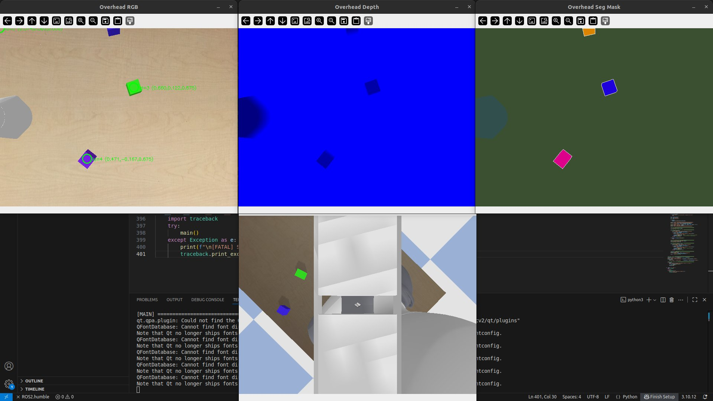
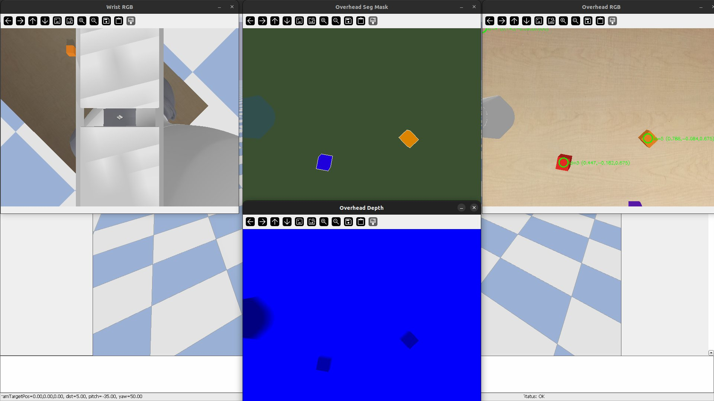
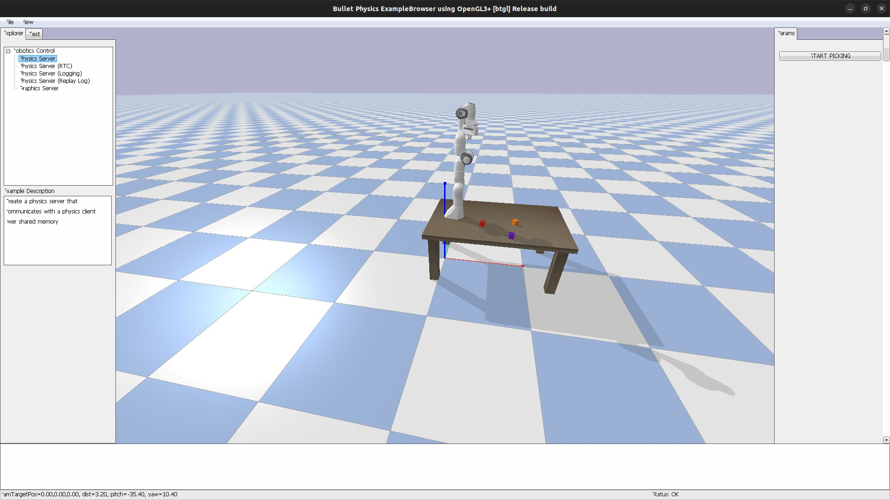
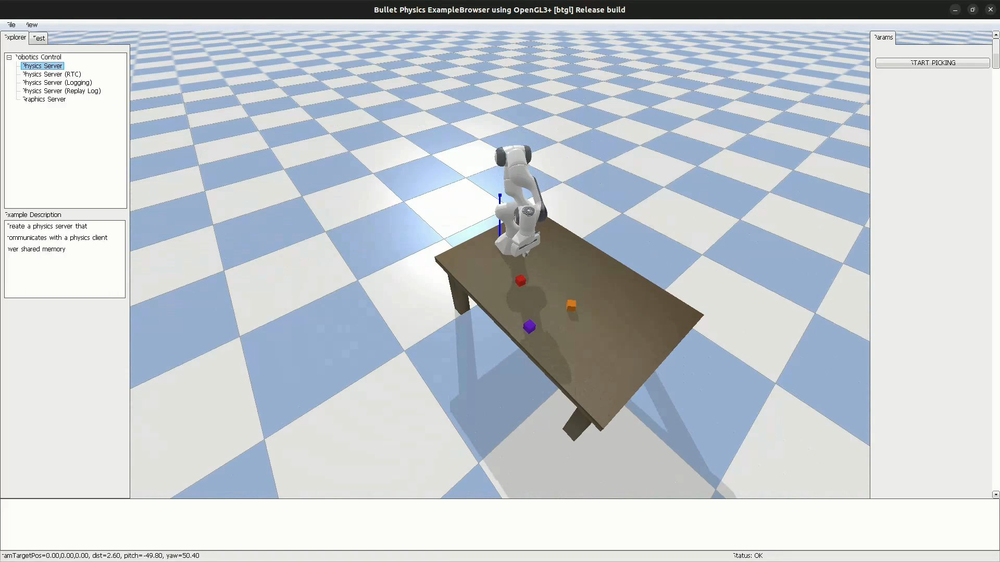

# 🤖 Franka Panda Autonomous Pick-and-Place (PyBullet)

A fully autonomous pick-and-place simulation for the **Franka Panda 7-DOF robotic arm**, built with PyBullet. The robot uses computer vision to detect randomly placed coloured cubes on a table, picks them up using inverse kinematics, and places them at designated drop zones — with automatic retry and failure recovery.

---

## 📸 Screenshots

### Simulation Environment

| Angled View | Front View |
|:-----------:|:----------:|
|  |  |
| *Franka Panda arm on a table with 3 randomly placed cubes. START PICKING button visible in the right sidebar.* | *Front-facing view of the robot and table. The blue/red axis markers show the robot base coordinate frame.* |

### Live Camera Feeds

| Camera Views | Vision Debug |
|:------------:|:------------:|
|  |  |
| *Left: Wrist-mounted RGB camera. Centre: Overhead segmentation mask. Right: Overhead RGB with detected cube world coordinates annotated.* | *Overhead RGB with 3D detections (top-left). Overhead Depth (top-centre). Seg Mask (top-right). Wrist RGB (bottom-centre). Terminal output in VS Code.* |

---

## ✨ Features

- **IK-based motion control** with joint limits, rest-pose seeding, and convergence checking
- **Segmentation-mask vision** — stable, flicker-free cube detection using PyBullet's ground-truth seg mask
- **Full 3D back-projection** — pixel + depth → real-world coordinates via matrix unprojection
- **Self-recovering IK** — automatic `safe_reset` on timeout + periodic reset every 3 cycles
- **Retry loop** — up to 3 attempts per cube with drop detection and place verification
- **4 live camera feeds** — overhead RGB / depth / segmentation + wrist-mounted view running in a background thread
- **Headless mode** — runs at full simulation speed with no GUI windows

---

## 🗂️ Project Structure

```
.
├── main.py           # Entry point — pipeline orchestration, retry loop, display thread
├── simulation.py     # PyBullet scene: table, robot, cubes, cameras
├── vision.py         # Segmentation-based detection + pixel→world back-projection
├── control.py        # IK controller, gripper, pick & place sequences
├── assets/
│   ├── sim_setup.png
│   ├── sim_front.png
│   ├── camera_views.png
│   └── vision_debug.png
└── README.md
```

| File | Responsibility |
|------|---------------|
| `simulation.py` | Loads the physics world, spawns random cubes, provides overhead + wrist cameras |
| `vision.py` | Detects cubes via seg mask, computes 3D world positions, renders camera overlays |
| `control.py` | Solves IK, drives joints, executes grasp/place sequences with convergence checks |
| `main.py` | Runs the full detect → pick → place loop with retry logic and live display |

---

## ⚙️ How It Works

### Pipeline

```
1. Scene Setup      →  Table + robot + 3 random cubes spawned, physics settles (2 s)
2. Perception       →  Overhead camera captures RGB + depth + seg mask
                        Vision system locates each cube → 3D world coordinate
3. Pick Sequence    →  Seed arm pose → approach → pre-grasp → grasp → lift
4. Place Sequence   →  Move to drop zone → descend in 2 stages → release → retract
5. Verify & Retry   →  Check cube is held / placed correctly, retry up to 3× if not
6. Live Display     →  Background thread streams 4 camera windows at ~30 fps
```

### Coordinate System

All positions are in **world coordinates (metres)**. The robot base sits at `[0.15, 0.0, 0.625]` (table surface). Cubes spawn at approximately `z = 0.650 m` (table + half-cube height).

---

## 🛠️ Setup & Installation

### Prerequisites

| Requirement | Version |
|-------------|---------|
| Python | 3.8 or higher |
| Ubuntu | 20.04 / 22.04 / 24.04 (recommended) |
| pip | latest |

> **Windows / macOS:** PyBullet runs on all platforms, but GUI rendering works best on Linux. On macOS, install via Homebrew's Python. On Windows, use WSL2 for best results.

---

### 1. Clone the repository

```bash
git clone https://github.com/your-username/panda-pick-place.git
cd panda-pick-place
```

### 2. Create a virtual environment (recommended)

```bash
python3 -m venv venv
source venv/bin/activate        # Linux / macOS
# venv\Scripts\activate         # Windows
```

### 3. Install dependencies

```bash
pip install pybullet numpy opencv-python
```

**Full dependency list:**

| Package | Purpose |
|---------|---------|
| `pybullet` | Physics simulation + robot URDF loading |
| `numpy` | Matrix math, coordinate transforms |
| `opencv-python` | Camera image display, contour detection, visualization |

> The Franka Panda URDF (`franka_panda/panda.urdf`) and standard assets (`plane.urdf`, `table/table.urdf`, `cube_small.urdf`) are bundled inside `pybullet_data` — no separate download needed.

---

### 4. Verify installation

```bash
python -c "import pybullet; import numpy; import cv2; print('All good!')"
```

---

## 🚀 Usage

### GUI mode (default)
Opens the PyBullet 3D window + 4 OpenCV camera windows. Press **START PICKING** in the PyBullet sidebar to begin.

```bash
python main.py
```

### Headless mode
No windows — runs at full simulation speed. Useful for testing, CI, or remote servers.

```bash
python main.py --headless
```

### Controls

| Action | How |
|--------|-----|
| Start the robot | Click **START PICKING** in the right sidebar |
| Quit early | Press `q` in any camera window |
| Rotate 3D view | Click + drag in the PyBullet window |
| Zoom | Scroll wheel in the PyBullet window |

---

## 📷 Camera Windows

| Window | Description |
|--------|-------------|
| **Overhead RGB** | Top-down colour view with green circle annotations showing detected cube IDs and world coordinates |
| **Overhead Depth** | Jet-colourised depth map clipped to 0.60–1.20 m to highlight table objects |
| **Overhead Seg Mask** | Segmentation mask — each body ID gets a unique stable colour; cubes shown bright/saturated |
| **Wrist RGB** | Live first-person view from the gripper, follows arm motion in real-time |

---

## 🔧 Configuration

Key parameters are defined at the top of each file:

### `main.py`
```python
DROP_ZONES = [
    [0.55, -0.15, 0.650],   # zone 1
    [0.55,  0.00, 0.650],   # zone 2
    [0.65, -0.10, 0.650],   # zone 3
]
SETTLE_TIME_S = 2.0          # physics warm-up time (seconds)
MAX_RETRIES   = 3            # retry attempts per cube
```

### `control.py`
```python
CONV_THRESH = 0.015   # convergence threshold in metres (1.5 cm)
MAX_STEPS   = 480     # max simulation steps per move_to() call
```

### `simulation.py`
```python
IMG_W, IMG_H = 640, 480   # camera resolution
NUM_CUBES    = 3          # cubes spawned per run
```

---

## 🐛 Troubleshooting

### PyBullet window doesn't open
```bash
# Install display dependencies on Ubuntu
sudo apt-get install libgl1-mesa-glx libglib2.0-0
```

### OpenCV windows don't render
```bash
# If running over SSH, use headless mode
python main.py --headless
# Or set display forwarding
export DISPLAY=:0
```

### `ModuleNotFoundError: No module named 'pybullet_data'`
```bash
pip install pybullet --upgrade
```

### IK not converging / arm not reaching cubes
- Ensure `PANDA_REST` seed pose in `control.py` is not modified — it is carefully tuned for the table-mounted configuration.
- Check that cube positions are within `[0.38, 0.80]` x-range. Cubes outside the reachable workspace are skipped automatically.

### `cv2.error` on image display
```bash
pip install opencv-python --upgrade
# or switch to headless OpenCV
pip install opencv-python-headless
```

---

## 📐 Known Limitations

- Straight-line IK trajectories — no motion planning or collision avoidance
- Height-only collision safety — arm may clip the table edge in extreme cube positions
- Simulation only — no real Franka robot interface
- Single-arm, single-table scene — no multi-robot support

---

## 📚 What You Learn Building This

- **Inverse Kinematics in practice** — joint limits, seed poses, convergence checking
- **3D vision from 2D images** — pixel + depth → world coordinates via full matrix unprojection
- **Robust state machines** — designing for failure: retry loops, drop detection, place verification
- **Coordinate frames** — world, robot, camera — keeping them consistent across the pipeline
- **Concurrency** — background display thread (30 fps) running alongside the control loop (240 Hz)
- **Physics debugging** — gripper contact forces, workspace limits, IK drift

---

## 📄 License

MIT License — see `LICENSE` for details.
